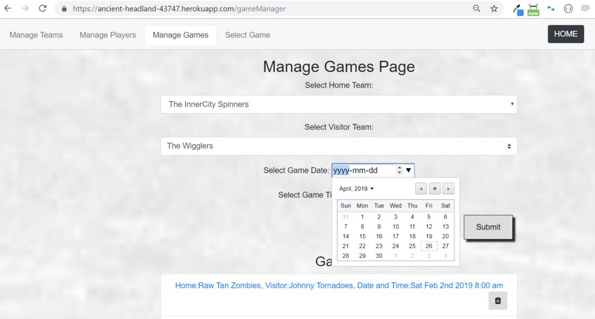

# Scorekeeper

- House league hockey application for capturing game data and providing real-time updates to subscribers

* Also includes creating teams, creating players, scheduling games and subscribing to game updates

## Link

- https://ancient-headland-43747.herokuapp.com/

## Contributors

- https://github.com/neilfr/Scorekeeper/graphs/contributors

## Problem

- House league scorekeepers have to manage electronic digital scoreboards while also tracking game statistics manually on hardcopy scoresheets that then have to be rekeyed into league systems.
- Family and friends that can't attend games would like to get real-time game updates.

## Technology

- Javascript, MySQL, Express, Node, Sequelize, Socket.io, JQuery, Heroku

# Quick Tour of the Application

## Scoreboard

- Simple interface allows for single click/touch that stops and starts the clock.
  

## Goal data capture

- A single click/touch stops the clock and presents the list of potential goal scorers
- Another single click/touch records the goal scorer, time of goal and notifies subscribers of the game update
  

## Near real-time updates

- Score Tracker provides subscribers with near real-time game clock updates every 1/10th of a second along with goal updates
  

## Game selector

- Allows subscribers to select which live games they want to track, or view past game results
  

## Team manager

- Provides a means to create teams, players and add players to teams
  

## Scheduler

- Allows the scheduling of games - selecting teams along with time and date
  
